## Laboratorio #4 – REST API Blueprints (Java 21 / Spring Boot 3.3.x)
# Escuela Colombiana de Ingeniería – Arquitecturas de Software  

---

## 📋 Requisitos
- Java 21
- Maven 3.9+

## ▶️ Ejecución del proyecto
```bash
mvn clean install
mvn spring-boot:run
```
Probar con `curl`:
```bash
curl -s http://localhost:8080/blueprints | jq
curl -s http://localhost:8080/blueprints/john | jq
curl -s http://localhost:8080/blueprints/john/house | jq
curl -i -X POST http://localhost:8080/blueprints -H 'Content-Type: application/json' -d '{ "author":"john","name":"kitchen","points":[{"x":1,"y":1},{"x":2,"y":2}] }'
curl -i -X PUT  http://localhost:8080/blueprints/john/kitchen/points -H 'Content-Type: application/json' -d '{ "x":3,"y":3 }'
```

> Si deseas activar filtros de puntos (reducción de redundancia, *undersampling*, etc.), implementa nuevas clases que implementen `BlueprintsFilter` y cámbialas por `IdentityFilter` con `@Primary` o usando configuración de Spring.
---

Abrir en navegador:  
- Swagger UI: [http://localhost:8080/swagger-ui.html](http://localhost:8080/swagger-ui.html)  
- OpenAPI JSON: [http://localhost:8080/v3/api-docs](http://localhost:8080/v3/api-docs)  

---

## 🗂️ Estructura de carpetas (arquitectura)

```
src/main/java/edu/eci/arsw/blueprints
  ├── model/         # Entidades de dominio: Blueprint, Point
  ├── persistence/   # Interfaz + repositorios (InMemory, Postgres)
  │    └── impl/     # Implementaciones concretas
  ├── services/      # Lógica de negocio y orquestación
  ├── filters/       # Filtros de procesamiento (Identity, Redundancy, Undersampling)
  ├── controllers/   # REST Controllers (BlueprintsAPIController)
  └── config/        # Configuración (Swagger/OpenAPI, etc.)
```

> Esta separación sigue el patrón **capas lógicas** (modelo, persistencia, servicios, controladores), facilitando la extensión hacia nuevas tecnologías o fuentes de datos.

---

## 📖 Actividades del laboratorio

### 1. Familiarización con el código base
- Revisa el paquete `model` con las clases `Blueprint` y `Point`.

    **Point** es un record, que representa un punto en un plano cartesiano con ejes x y y.

    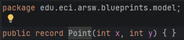

    **Bluesprint** por otro lado, se integra de lo siguiente:
  - Un nombre.
  - Un autor.
  - Una lista de Point que integra el plano.
  
    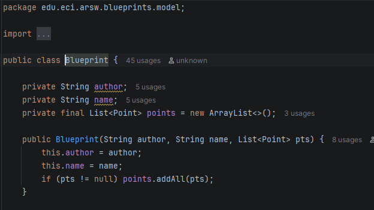
    
- Entiende la capa `persistence` con `InMemoryBlueprintPersistence`.  

    La capa de persistencia es una implementación del patron DAO.

    
    
    - BlueprintPersistence define los métodos de interacción con la base de datos.
    - InMemoryBlueprintPersistence implementa la interfaz y guarda los valores en memoria.
    - Los TransferObjects es la propia clase Bluesprint.
    
    InMemory crea predeterminadamente cuando se levanta la aplicación una lista con algunos predeterminados y lo guarda
    como un atributo, permite crear, eliminar y leer nuevos Bluesprint. Pero se reinicia el guardado cada vez que se levanta
    de nuevo la aplicación.
    
- Analiza la capa `services` (`BlueprintsServices`) y el controlador `BlueprintsAPIController`.
    - La capa BlueprintsServices cumple el rol de intermediario entre el controlador y la capa de persistencia, encapsulando la lógica de negocio de la aplicación. Esto permite que los controladores no accedan directamente a la base de datos, promoviendo una separación clara de responsabilidades.
    - El BlueprintsAPIController se encarga exclusivamente de exponer los endpoints REST, recibir las solicitudes HTTP, validar los datos de entrada y delegar el procesamiento al servicio inyectado por Spring mediante inyección de dependencias.
    - Este diseño sigue una arquitectura (Controller - Service - Persistence).
  
### 2. Migración a persistencia en PostgreSQL
- Configura una base de datos PostgreSQL (puedes usar Docker).  
    Usando docker, con la imagen de postgres, fue sencillo construir un contenedor con la api y la base de datos.

     ```bash
    docker compose up ---build
    ```
    
    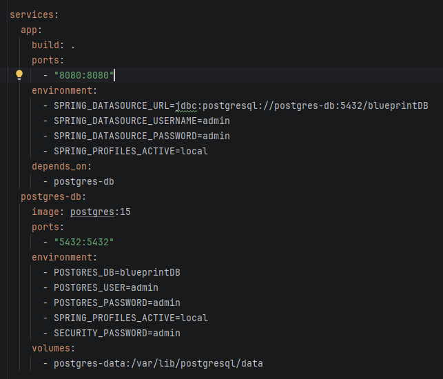

    
- Implementa un nuevo repositorio `PostgresBlueprintPersistence` que reemplace la versión en memoria. 
- Mantén el contrato de la interfaz `BlueprintPersistence`.

    - Lo primero que es necesario para el funcionamiento de la aplicación con postgresql, es añadir las siguientes
    dependencias.
    
    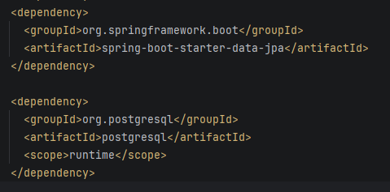
    
    Una para el uso de JPA(Java Persistence API) Para gestionar la persistencia, permitiendo mapear objetos
    Java a tablas de bases de datos relacionales. La otra dependencia permite que la aplicación se conecte con Postgresql

    - Ya con las dependencias, primero se crea el nuevo repositorio, el cual tiene dos características muy importantes:
      1. Extiende JpaRepository que es una interfaz que facilita la comunicación con la base de datos.
      2. Extiende BlueprintPersistence para seguir el patron de DAO, de esta forma se mantiene tanto la extensibilidad,
        como el desacople del sistema.
      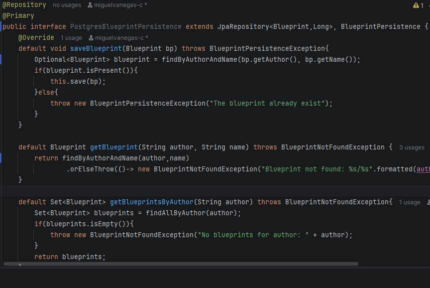
    
    - También fue necesario realizar algunos cambios en las clases de Blueprint y point para que la implementación funcione correctamente.
        1. Se modificó primero Point debido a que íbamos a usar una base de datos en postgres se podía llegar a tener problemas en caso de que
        Se mantuviera como un record, se hizo el cambio a una clase, se le añadio la anotación de entity, NoArgsConstructor, se construyo el campo id y se hizo la relación con Blueprint.
        
        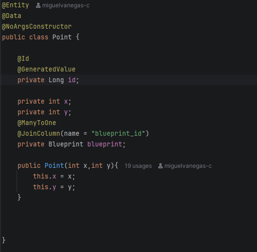

        2. Después se modificó blueprint con un proceso parecido al de Point, con la diferencia que la relación con point se marcó de uno a muchos,
        también se construyó el campo id.
      
        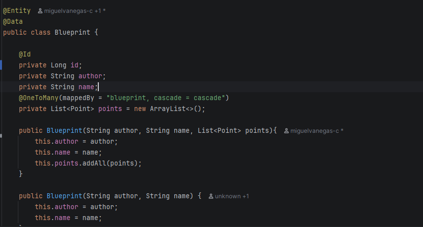
        
  

### 3. Buenas prácticas de API REST
- Cambia el path base de los controladores a `/api/v1/blueprints`.  
    
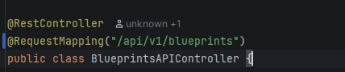

- Usa **códigos HTTP** correctos:  
  - `200 OK` (consultas exitosas).  
  - `201 Created` (creación).  
  - `202 Accepted` (actualizaciones).  
  - `400 Bad Request` (datos inválidos).  
  - `404 Not Found` (recurso inexistente).  
- Implementa una clase genérica de respuesta uniforme:
  ```java
  public record ApiResponse<T>(int code, String message, T data) {}
  ```
  Ejemplo JSON:
  ```json
  {
    "code": 200,
    "message": "execute ok",
    "data": { "author": "john", "name": "house", "points": [...] }
  }
  ```
  - Para cumplir con buenas prácticas de API REST, se realizaron los siguientes campos:
    1. Primero se creó una clase que maneje las excepciones y sus respuestas, dependiendo la excepción la toma y crea un APIResponse,  

    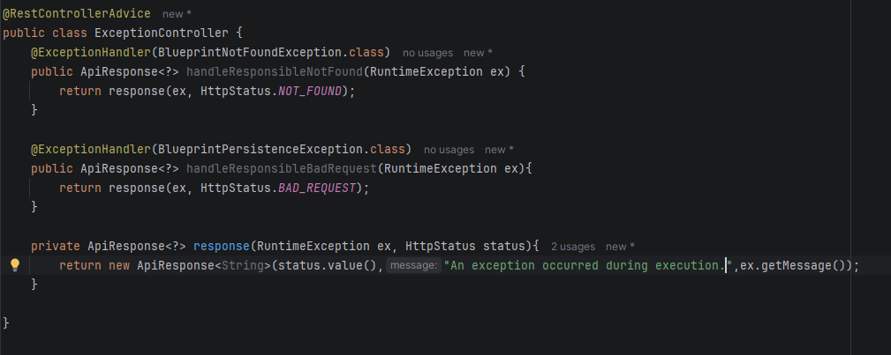
  
    2. Para que las respuestas de las excepciones funcionen, también se modifico el BlueprintsAPIController, ya que en vez de manejar
        las excepciones las propaga.
    3. Aparte en el controller se modifico la manera en la que devuelven las respuestas y se redujo la cantidad de codigo, ya que dejo de ser
        necesario su manejo.
    
    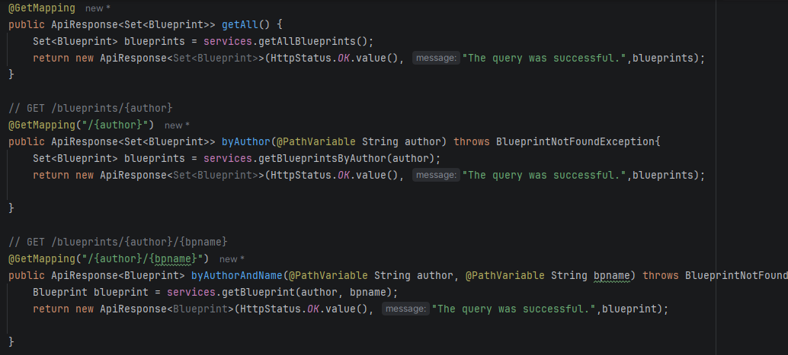
    

### 4. OpenAPI / Swagger
- Configura `springdoc-openapi` en el proyecto.
- Expón documentación automática en `/swagger-ui.html`.  
- Anota endpoints con `@Operation` y `@ApiResponse`.
    
    1. Se busca y se agrega la dependencia con la version más actual, compatible con la versión usada de springboot:
    
        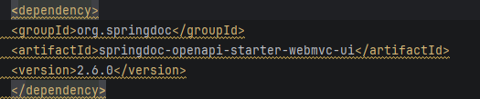
  
    2. Una vez agregada se valida que se esté generando correctamente, construyendo el docker y entrando a la url:
  
        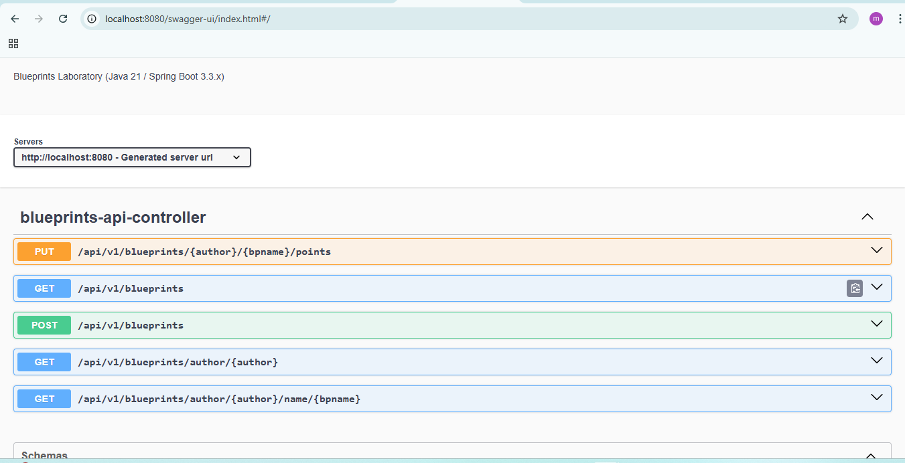
    
    3. Se agregaron las respectivas anotaciones y se personalizó una pequeña parte de la documentación.
    
        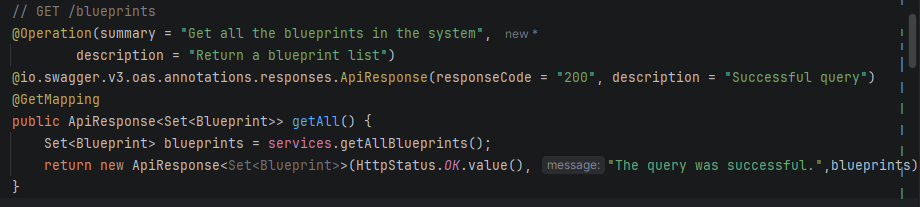
    

### 5. Filtros de *Blueprints*
- Implementa filtros:
  - **RedundancyFilter**: elimina puntos duplicados consecutivos.  
  - **UndersamplingFilter**: conserva 1 de cada 2 puntos.  
- Activa los filtros mediante perfiles de Spring (`redundancy`, `undersampling`).  

---
- Los filtros ya se encuentran implementados, se realiza la activación por medio del properties.
    
    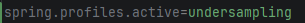    


### Buenas Prácticas de API REST

#### Test
Se realizaron pruebas de aceptación, para la capa de servicio y pruebas unitarias para validar el funcionamiento
principalmente de los filtros, el siguiente fue el coverage conseguido:
    
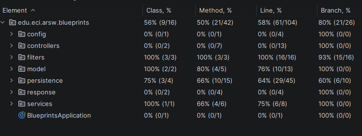

#### DTO
Se implementation DTOs para la tranferencia de datos entre capaz del sistema:

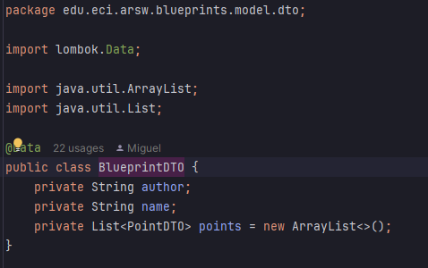
#### MAPPER
Se implementaron mappers para la transformación de datos a entidades y viceversa,
buscando reducir la cantidad de código:

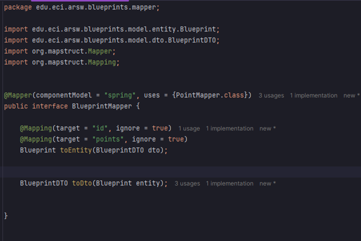

- Para esto se usó mapstruck, que es una libreria que permite automatizar el mapeo de datos en clases de java.
- Por lo tanto, se agregó la siguiente dependencia y puglin:

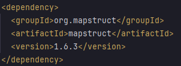
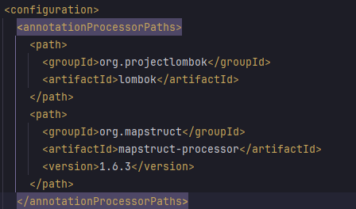
#### LOMBOK
Se usaron etiquetas de lombok, debido a que mantiene el código limpio y reduce la cantidad del codigo:

**Etiquetas usadas:**
1. Data
2. NoArgsConstructor
3. All ArgsConstructor

## ✅ Entregables

1. Repositorio en GitHub con:  
   - Código fuente actualizado.  
   - Configuración PostgreSQL (`application.yml` o script SQL).  
   - Swagger/OpenAPI habilitado.  
   - Clase `ApiResponse<T>` implementada.  

2. Documentación:  
   - Informe de laboratorio con instrucciones claras.  
   - Evidencia de consultas en Swagger UI y evidencia de mensajes en la base de datos.  
   - Breve explicación de buenas prácticas aplicadas.  

---

## 📊 Criterios de evaluación

| Criterio | Peso |
|----------|------|
| Diseño de API (versionamiento, DTOs, ApiResponse) | 25% |
| Migración a PostgreSQL (repositorio y persistencia correcta) | 25% |
| Uso correcto de códigos HTTP y control de errores | 20% |
| Documentación con OpenAPI/Swagger + README | 15% |
| Pruebas básicas (unitarias o de integración) | 15% |

**Bonus**:  

- Imagen de contenedor (`spring-boot:build-image`).  
- Métricas con Actuator.  